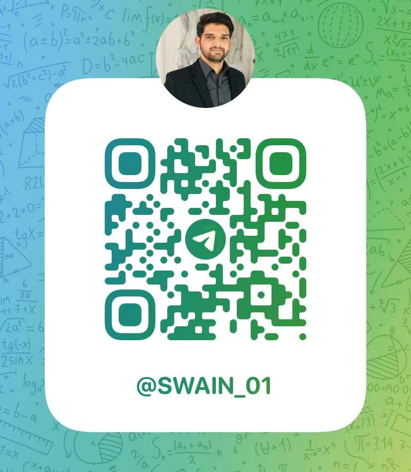

# 1- **Headings**

How to give headings in markdown file

# **Heading 1**

## heading 2

### heading 3

#### heading 4


##### So on 
 
 # **2- Writing block of words**
 This is a normal text in markdwon 

 > This is a special text box

 > This is another special text box
  # **3-Lines break** 
  This is a 40 days long course named as python ka chilla with baba ammar or data science with python. \
  This is a second line. 

  # **4- Block of words in a heading**
   These are the block of words

   > ## This is a heading 

  # **5- Face of text**

  **Bold**

  *Italic*

  ***Bold and Italic***

  **Using symboles**

  Also we can use __Bold__ and _Italic_ Syboles 

  # **6- Bullets Points or Lists**

  - **Sat**
    - Chilla 
  - **Sun**
    - Home Work 
    - Badminton
    - Webniar 
    - Chilla 
  - **Mon** 
    - Class 1
    - Class 2 
    - Chilla 
  - __Tue__
    - Chilla 
  - __Wed__
    - Chilla 
  - __Thu__
    - Chilla 
  - __Fri__
    - Chilla 
> **Numbering of Lists**

1. Python 
2. C++
3. Java 
4. R

# __7- Line break or page break__

__This is page one.__
- - - 
___
***
__This is page two.__

# __8- Links and hyperlinks__

<https://www.youtube.com/watch?v=qJqAXjz-Rh4&list=PL9XvIvvVL50HVsu-Ao8NBr0UJSO8O6lBI&index=21>

__The click here option__
 
 [ watch complete playlist of Python Ka Chilla](https://www.youtube.com/watch?v=qJqAXjz-Rh4&list=PL9XvIvvVL50HVsu-Ao8NBr0UJSO8O6lBI&index=21)

 [Markdown]: https://www.youtube.com/watch?v=qJqAXjz-Rh4&list=PL9XvIvvVL50HVsu-Ao8NBr0UJSO8O6lBI&index=21
  To watch  with baba please click [here][Markdown]


# **9- Images and Figuers**
To join me on telegram please scan my qr code and join me on telegram. you can find many resources on thi stelegram group. 


 


 # **10- Adding code block**

__To add code or code block__

> To print a code e.g.     `print("Hello World")` \
Multiple Line of codes 

``` 
print("Hello Baba") 
print("Python is a programming language")
print("A quick brown Fox")
```
# __11- Adding Tables__

Column A | Column B | Column C | Column D |
---------|----------|----------|----------|
 A1      | B1       | C1       | D1       | 
 A2      | B2       | C2       | D2       |
 A3      | B3       | C3       | D3       | 
__Look for it__

# __12-Table of content__

[1- __Headings__](#1--headings)\
[2- __Block of words/citation__](#2--writing-block-of-words)\
[3- __line breaks__](#3-lines-break)\
[4- __block of words in heading__](#4--block-of-words-in-a-heading)\
[5- __face of text__](#5--face-of-text)\
[6- __bullets__](#6--bullets-points-or-lists)\
[7- __line break, page break__](#7--line-break-or-page-break)\
[8- __link and hyperlink__](#8--links-and-hyperlinks)\
[9- __images, qr codes__](#9--images-and-figuers)\
[10- __code blocks__](#10--adding-code-block)\
[11- __adding tables__](#11--adding-tables)


# **13- Extensions**
- __[ Use of extensions ]__
- 